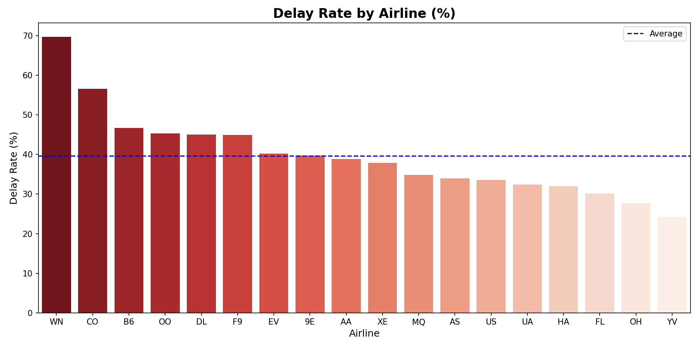
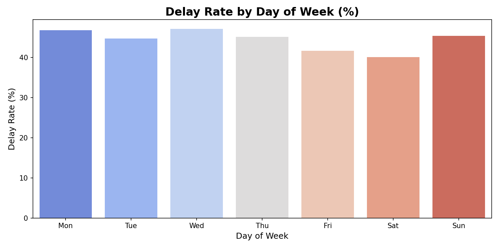
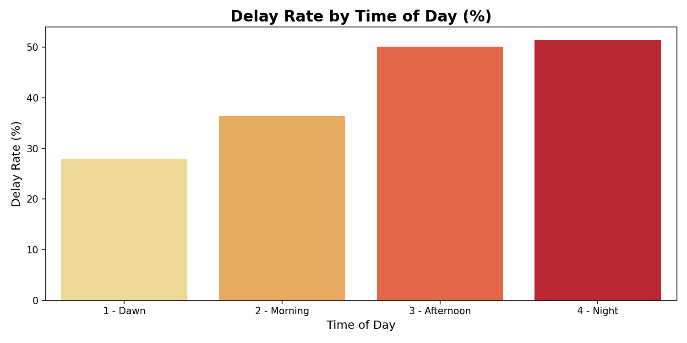
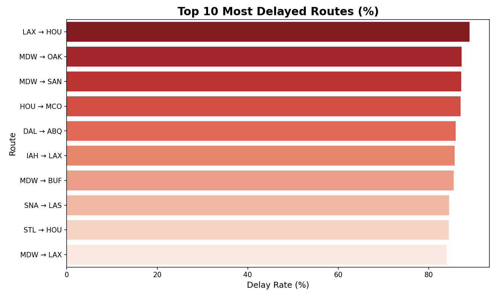

# ✈️ Airline Delay & Performance Analysis


> **Business Question:** Which airlines, routes, days, and times are responsible for the most flight delays — and what can the data tell us about it?

---

## 📌 Project Overview

This project analyzes **539,383 real flight records** to uncover delay patterns across airlines, routes, days of the week, and times of day.

The goal is to provide actionable insights that an airline operations team could use to reduce delays and improve passenger experience.

---

## 📁 Project Structure

```
airline-delay-performance-analysis/
│
├── 📁 data/
│   └── airlines.csv
│
├── 📁 images/
│   ├── delay_by_airline.png
│   ├── delay_by_day.png
│   ├── delay_by_time.png
│   └── delay_by_route.png
│
├── 📁 notebooks/
│   └── analysis.ipynb
│
├── 📁 sql/
│   └── queries.sql
│
├── 📄 .gitignore
├── 📄 requirements.txt
└── 📄 README.md
```

---

## 🗃️ Dataset

| Field | Description |
|---|---|
| `Airline` | Airline code (e.g. WN, DL, AA) |
| `Flight` | Flight number |
| `AirportFrom` | Departure airport (IATA code) |
| `AirportTo` | Arrival airport (IATA code) |
| `DayOfWeek` | Day of the week (1=Monday, 7=Sunday) |
| `Time` | Departure time in minutes from midnight |
| `Length` | Flight duration in minutes |
| `Delay` | 1 = delayed, 0 = on time |

**Source:** [Airlines Dataset — Kaggle](https://www.kaggle.com/datasets/jimschacko/airlines-dataset-to-predict-a-delay)

---

## 🛠️ Tech Stack

- **Python** — data cleaning and visualization
- **Pandas** — data manipulation
- **Matplotlib & Seaborn** — charts
- **MySQL** — analytical queries
- **SQLAlchemy** — Python ↔ MySQL connection
- **Jupyter Notebook** — development environment

---

## 📊 Key Findings

### 1 — Delay Rate by Airline



- **WN (Southwest)** has the worst delay rate at **69.8%** — nearly 7 out of every 10 flights are delayed
- **YV (Mesa Airlines)** is the most punctual with only **24.3%** delay rate
- 10 out of 18 airlines operate above the **40% average delay rate**

---

### 2 — Delay Rate by Day of Week



- **Saturday** is the best day to fly — lowest delay rate at **40.1%**
- **Wednesday** is the worst day — **47.1%** delay rate with nearly 90,000 flights operating
- The difference between best and worst day is **7 percentage points**

---

### 3 — Delay Rate by Time of Day



- **Morning flights (06h–12h)** have the lowest delay rate at **36.4%**
- **Night flights (18h–24h)** are the most problematic at **51.4%**
- This is explained by the **cascade effect** — delays accumulate throughout the day as aircraft and crews run behind schedule

---

### 4 — Top 10 Most Delayed Routes



- **LAX → HOU** is the most chaotic route — **88.98%** delay rate
- **MDW (Chicago Midway)** appears **4 times** in the top 10 as a departure airport, indicating a structural operational problem at this hub
- All top 10 routes have delay rates above **83%**

---

## 💡 Business Recommendations

| Finding | Recommendation |
|---|---|
| WN delays 70% of flights | Urgent operational review needed |
| Night flights delay 51% | Prioritize on-time morning departures to avoid cascade effect |
| Wednesday is the worst day | Increase ground crew and gate resources mid-week |
| MDW appears 4x in worst routes | Infrastructure and scheduling audit at Chicago Midway |
| LAX → HOU at 89% delay | Route scheduling and turnaround time review |

---

## ▶️ How to Run

**1. Clone the repository**
```bash
git clone https://github.com/Luiz-mila/airline-delay-performance-analysis.git
cd airline-delay-performance-analysis
```

**2. Install dependencies**
```bash
pip install -r requirements.txt
```

**3. Set up MySQL**
- Create a database called `airlines_project`
- Update your credentials in the notebook connection string

**4. Run the notebook**
```bash
jupyter notebook notebooks/analysis.ipynb
```

---

## 👤 Author

**Luiz Milaré**
Data Analyst | SQL • Python • Business Analytics

LinkedIn: https://www.linkedin.com/in/luiz-milar%C3%A9-a5869519a/

Email: luizmilare958@gmail.com

GitHub: github.com/Luiz-mila

Location: Paris, France 🇫🇷


---

*This project is part of my Data Analysis portfolio. Focused on SQL, Python, and business storytelling.*
